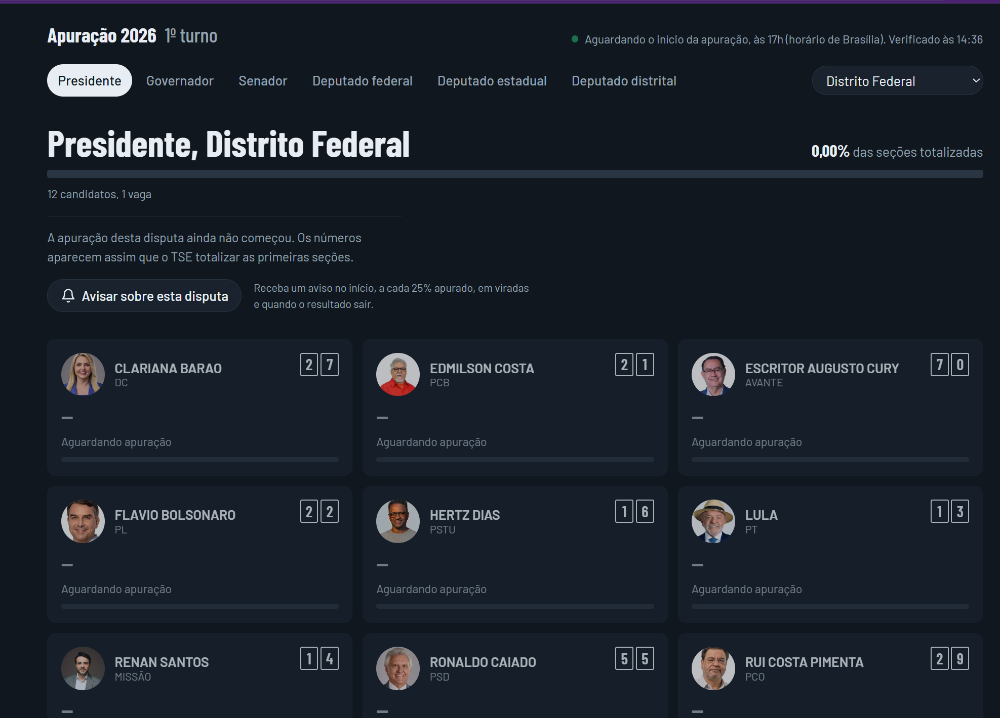
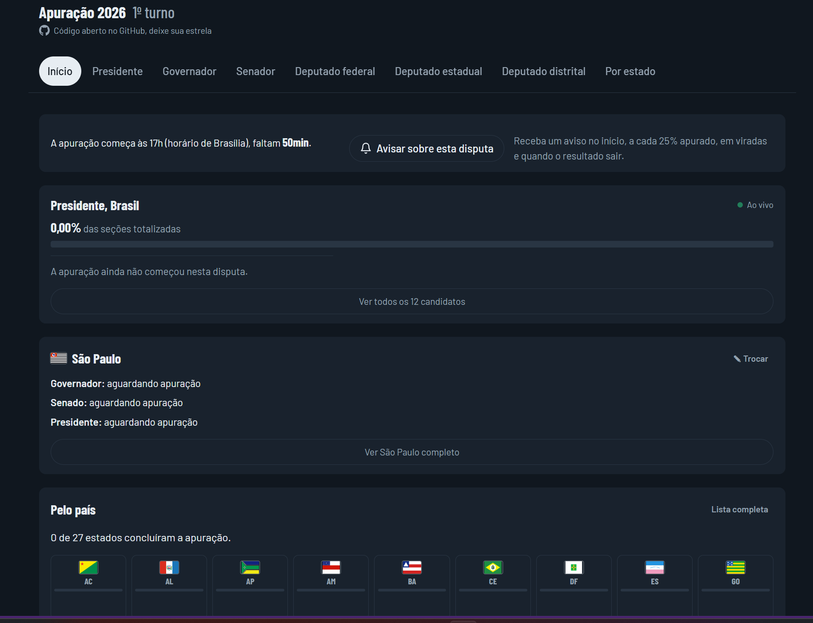
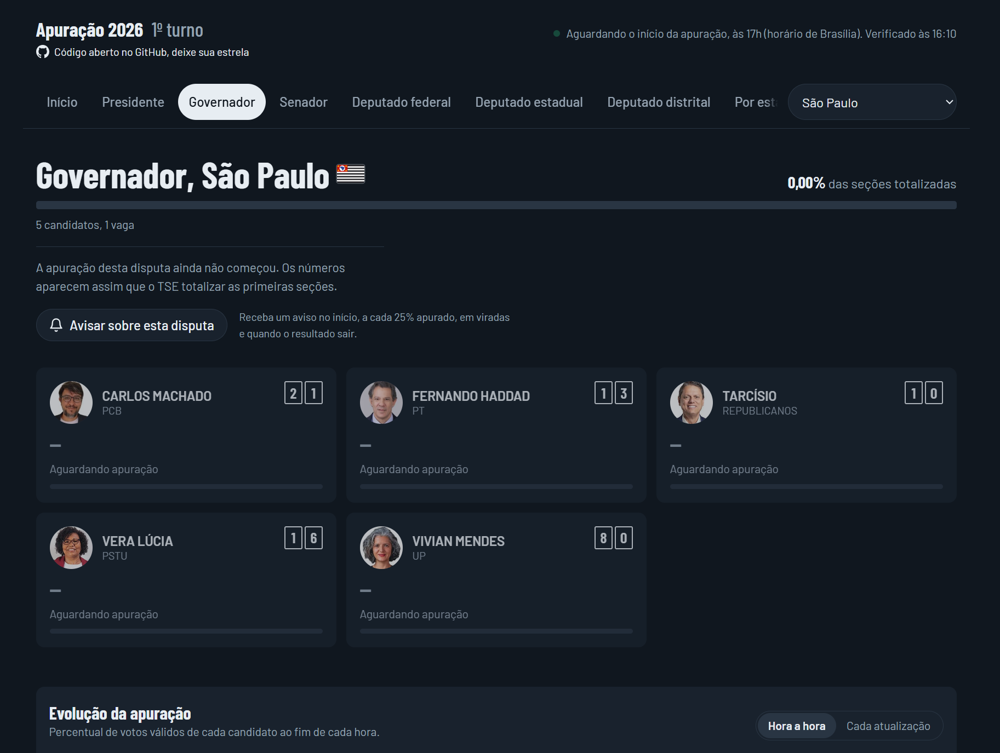
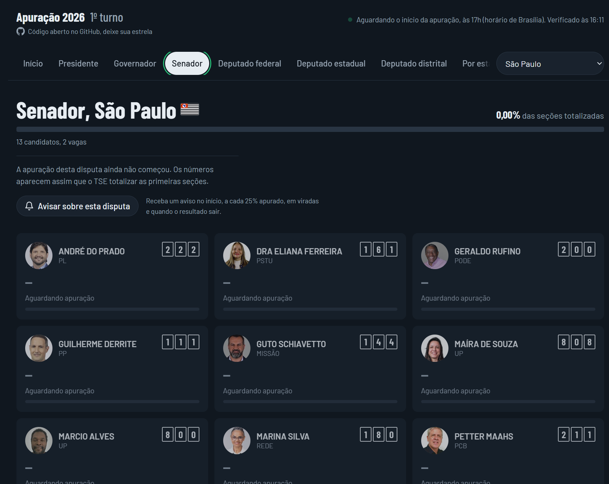
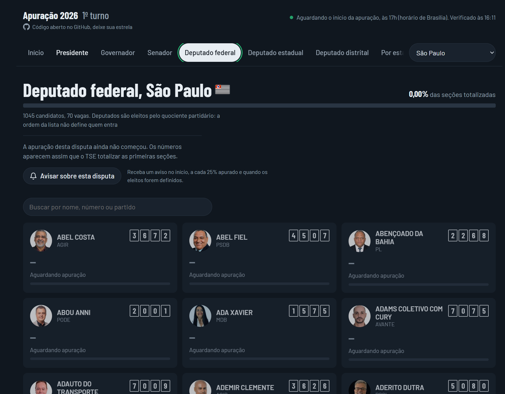
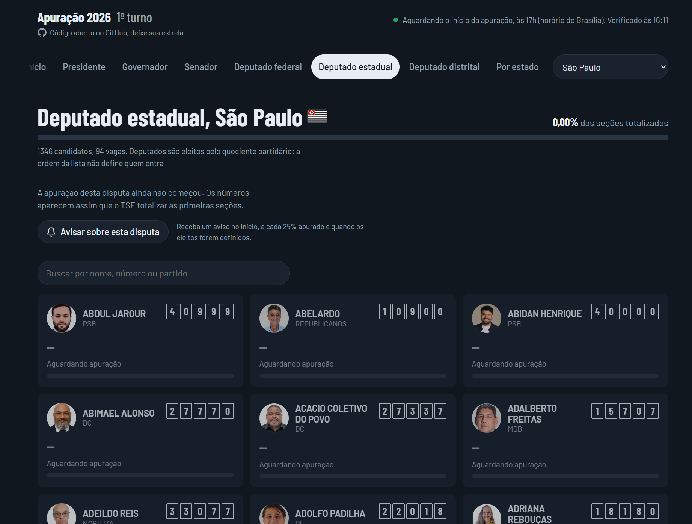
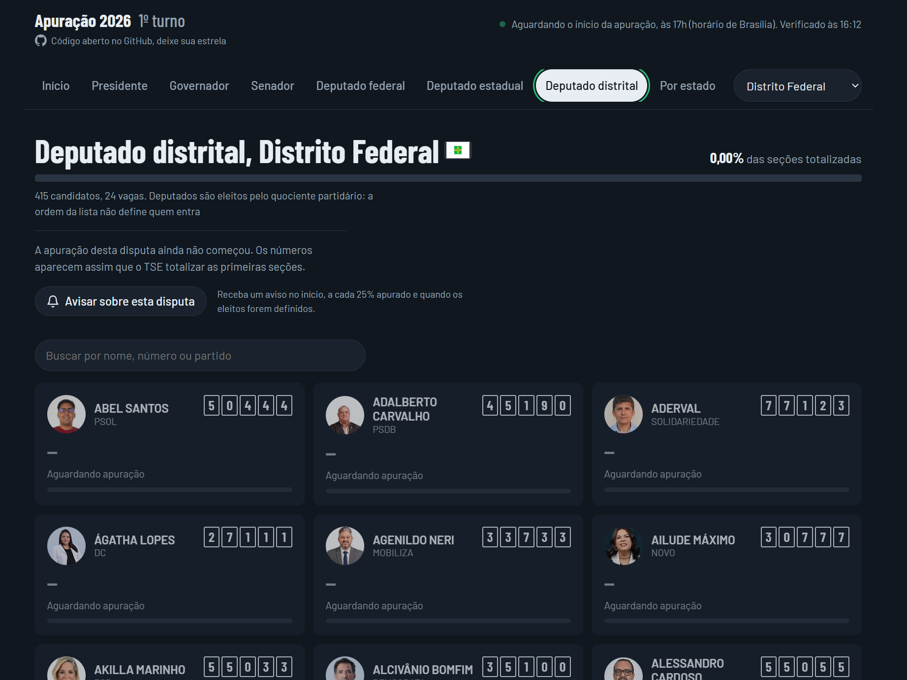
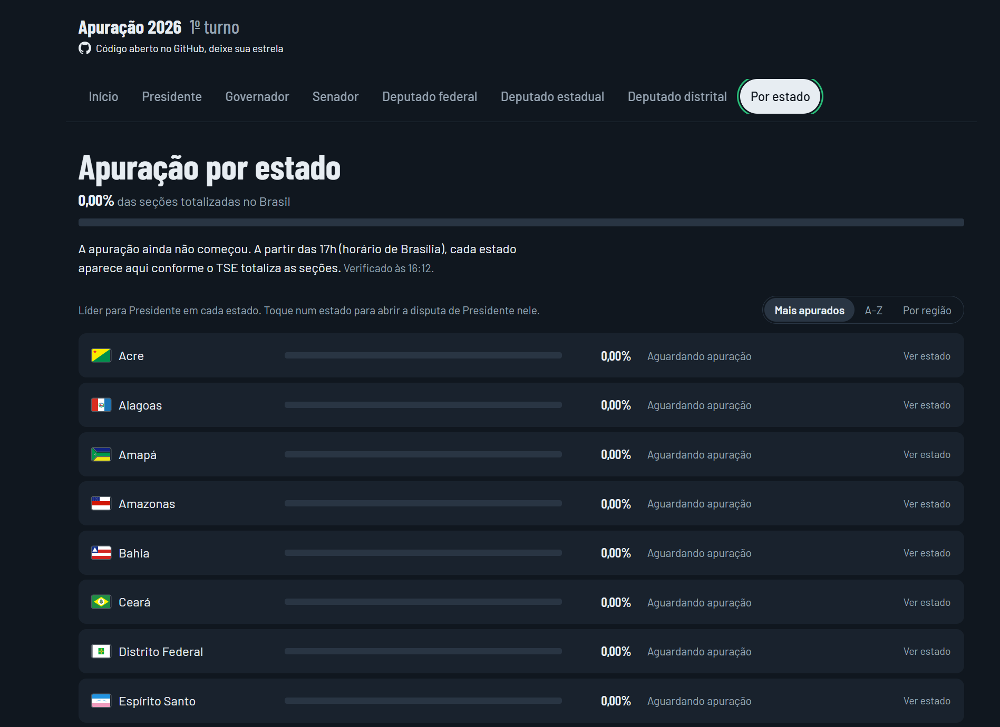
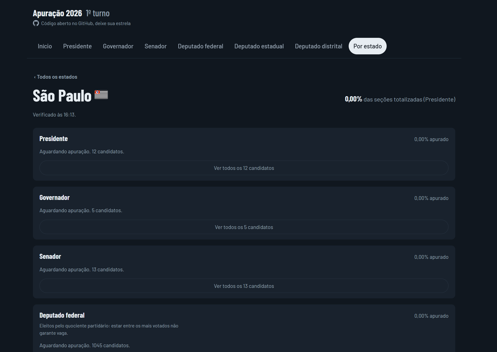
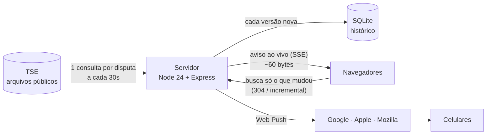

<p align="center">
  
</p>

<h1 align="center">Apuração 2026</h1>

<p align="center">
  Acompanhe a apuração das eleições brasileiras de 2026 em tempo real, com dados oficiais do TSE:<br>
  todos os cargos, fotos dos candidatos, gráfico hora a hora e notificações no celular.
</p>

<p align="center">
  
  
  
  
  
  
  <a href="LICENSE"></a>
</p>

<p align="center">
  <a href="https://eleicoes.code-cfernandes.com"><b>Acompanhe ao vivo em eleicoes.code-cfernandes.com</b></a><br>
  <sub>No ar durante o 1º e o 2º turno de 2026. No celular, instale o app e ative os avisos da sua disputa.</sub>
</p>

<p align="center">
  <b>Se o projeto te ajudou ou você achou interessante, deixe uma ⭐ — é o que ajuda outras pessoas a encontrá-lo.</b>
</p>

<p align="center">
  
</p>

---

## O que ele faz

- **Todos os cargos de 2026**: Presidente (Brasil e por UF), Governador, Senador, Deputado federal, Deputado estadual e Deputado distrital.
- **Leitura em segundos**: quem lidera, por quantos pontos e votos, quanto falta para os 50% (Presidente e Governador), quem está dentro das vagas (Senado) e se a disputa já foi definida.
- **Fotos oficiais** das candidaturas, vindas do próprio TSE, e o número de cada candidato nas caixinhas da urna eletrônica.
- **Apuração por estado**: quanto cada UF já apurou, lado a lado, com a bandeira do estado e a foto de quem lidera para Presidente; ordene por andamento, nome ou região. Os votos do exterior aparecem à parte.
- **Visão de cada estado**: toque num estado e veja todos os cargos dele de uma vez, com os mais votados para Presidente, Governador, Senado e deputados.
- **Gráfico de evolução** com todos os candidatos, hora a hora ou a cada atualização do TSE, com o histórico guardado no servidor (quem chega às 22h vê a noite inteira).
- **Ao vivo**: a tela se atualiza sozinha assim que o TSE publica dados novos, sem recarregar.
- **Notificações no celular (PWA)**: siga uma disputa e receba aviso no início da apuração, a cada 25%, em viradas e quando o resultado sair.
- **Busca** por nome, número ou partido nas listas de deputados (mais de mil candidatos em SP).
- **Modo escuro**, acessível e pensado primeiro para o celular.

> [!NOTE]
> Projeto independente, **sem vínculo com o TSE**. Os dados vêm dos arquivos públicos de resultados em `resultados.tse.jus.br`. Em caso de divergência, vale o resultado oficial do TSE.

## Telas

<details>
<summary>Ver as telas (início, cargos, estados)</summary>

| Início | Presidente |
|---|---|
|  |  |

| Governador | Senador |
|---|---|
|  |  |

| Deputado federal | Deputado estadual | Deputado distrital |
|---|---|---|
|  |  |  |

| Apuração por estado | Visão de um estado |
|---|---|
|  |  |

</details>

Próximos passos: veja a [proposta de redesign](docs/proposta-redesign.md) (central de acompanhamento com tema escuro, mapa, linha do tempo e navegação inferior no celular).

## Rodando em 1 minuto

Com Docker:

```bash
git clone https://github.com/code-cfernandes/eleicoes-2026-brasil.git
cd eleicoes-2026-brasil
docker compose up -d --build
```

Abra <http://localhost:3000>. Não precisa de `.env`: os padrões já apontam para o 1º turno de 2026.

Sem Docker (Node 24 ou superior):

```bash
npm install
cp .env.example .env
npm run build
npm start
```

## Como funciona



Algumas decisões que fazem diferença na noite da eleição:

| Problema | Solução |
|---|---|
| Milhares de pessoas abrindo o site não podem virar milhares de consultas ao TSE | Cache curto com deduplicação: **1 consulta por disputa a cada 30s**, não importa quantos aparelhos estejam abertos |
| Atualizar a tela sem cada aparelho perguntar "mudou?" a cada poucos segundos | **Server-Sent Events**: o servidor avisa quando o TSE publica uma versão nova; sem SSE disponível, a tela volta sozinha para consultas periódicas |
| Mil aparelhos buscando o mesmo resultado no mesmo segundo | O aviso só diz "tem versão nova"; cada aparelho espera um tempo aleatório proporcional à audiência antes de buscar, e o servidor serializa e comprime cada versão **uma única vez** |
| Baixar de novo o que o aparelho já tem | **ETag + 304** quando o TSE não mudou, e histórico **incremental** (`?desde=`) |
| Quem chega tarde não vê a evolução | Cada versão do TSE vai para o **SQLite**; o gráfico hora a hora sai de uma consulta com janela por hora de Brasília |
| Notificação que vira spam | Avisos só nos momentos que importam, com estado persistido (ninguém recebe aviso repetido após restart) e expiração de 30 min |

Números medidos num teste de carga local (Deputado federal SP, o JSON mais pesado):

| Aparelhos conectados ao vivo | Aviso chega a metade deles | Latência p99 da busca após o aviso |
|---|---|---|
| 1.000 | 8 ms | 25 ms |
| 5.000 | 20 ms | 10 ms |
| 10.000 | 86 ms | 18 ms |

## Configuração

Tudo por variáveis de ambiente (veja [`.env.example`](.env.example)). Com Docker, o `compose.yaml` já traz padrões para todas; no Portainer, basta cadastrar as que quiser mudar.

| Variável | Padrão | Para que serve |
|---|---|---|
| `ELEICAO_FEDERAL` / `ELEICAO_ESTADUAL` | `6257` / `6259` | Códigos da eleição no TSE. No 2º turno, troque: `npm run eleicoes` lista os códigos publicados |
| `TURNO` | `1º turno` | Texto exibido no topo |
| `CACHE_SEGUNDOS` | `30` | Intervalo de consulta ao TSE |
| `MONITORAR` | `br:1` | Disputas coletadas mesmo sem ninguém na tela. Formato `uf:cargo`, `*` vale todos (ex.: `br:1,*:3,*:5`) |
| `MAX_CONEXOES` | `5000` | Conexões ao vivo simultâneas; acima disso o aparelho volta às consultas periódicas |
| `MAX_INSCRICOES` | `50000` | Aparelhos inscritos em notificações |
| `VAPID_CONTATO` | — | Contato exigido pelos serviços de push (`mailto:` ou `https:`). Sem ele, a Apple pode recusar notificações |
| `VAPID_PUBLICA` / `VAPID_PRIVADA` | geradas sozinhas | Chaves das notificações. Se vazias, são criadas na 1ª execução e guardadas no volume |
| `PORTA_HOST` | `3000` | Porta publicada pelo Docker |

Códigos dos cargos: `1` Presidente, `3` Governador, `5` Senador, `6` Dep. federal, `7` Dep. estadual, `8` Dep. distrital.

### Publicando

- **HTTPS é obrigatório** para instalar o app e receber notificações no celular (só `localhost` é exceção). Um proxy como Caddy, Traefik, nginx ou um **Cloudflare Tunnel nomeado** resolve, e ainda traz HTTP/2.
- O túnel rápido do Cloudflare (`*.trycloudflare.com`) não suporta SSE: serve para testes, e o site volta sozinho às consultas periódicas.
- No iPhone, as notificações só funcionam com o app **adicionado à Tela de Início** (iOS 16.4+). O site explica isso a quem abre pelo Safari.
- Não apague o volume `dados`: ele guarda o histórico e as chaves das notificações. Se as chaves mudarem, todos os aparelhos inscritos param de receber.

## Desenvolvimento

```bash
npm run dev:api     # backend com recarga automática (porta 3000)
npm run dev:web     # frontend Vite com proxy para a API
npm run typecheck   # tipos do backend e do frontend
npm run simular     # cria data/simulado.db com uma apuração fictícia para testar o gráfico
```

```
server/    backend em TypeScript, executado direto pelo Node 24 (sem etapa de build)
  tse.ts            único ponto que conhece o formato do JSON do TSE
  historico.ts      SQLite: snapshots, consulta hora a hora e incremental
  eventos.ts        conexões ao vivo (SSE)
  notificacoes.ts   Web Push: inscrições, detecção de marcos e fila de envio
web/       frontend React + Vite + Recharts, service worker e manifest do PWA
shared/    tipos usados pelo backend e pelo frontend
```

O TSE muda detalhes do leiaute entre eleições. Se algo quebrar num pleito futuro, o ajuste fica concentrado em `server/tse.ts`.

## Contribuindo

Issues e pull requests são bem-vindos: correções, melhorias de acessibilidade, suporte ao 2º turno ou a eleições municipais.

Se este projeto foi útil, **deixe uma ⭐ no repositório** e compartilhe com quem vai acompanhar a apuração.

## Créditos

- Resultados, fotos das candidaturas e configurações das eleições: arquivos públicos do [Tribunal Superior Eleitoral](https://resultados.tse.jus.br).
- Mapa do Brasil: malha territorial por UF do [IBGE](https://servicodados.ibge.gov.br/api/docs/malhas?versao=3) (dados abertos, © IBGE), simplificada para uso na web.
- Bandeiras dos estados: [Wikimedia Commons](https://commons.wikimedia.org), todas em domínio público (símbolos oficiais), convertidas para PNG em tamanho reduzido.

## Licença

[MIT](LICENSE): use, modifique e distribua à vontade, mantendo o aviso de copyright.
