<p align="center">
  
</p>

<h1 align="center">Apuração 2026</h1>

<p align="center">
  Acompanhe a totalização das eleições brasileiras de 2026 em tempo real, com dados oficiais do TSE:<br>
  todos os cargos, fotos dos candidatos, mapa por estado, linha do tempo e notificações no celular.
</p>

<p align="center">
  
  
  
  
  
  
  <a href="LICENSE"></a>
</p>

<p align="center">
  <a href="https://eleicoes.code-cfernandes.com"><b>Acompanhe ao vivo em eleicoes.code-cfernandes.com</b></a><br>
  <sub>No ar até 28/10/2026 (1º e 2º turno). No celular, instale o app e ative os avisos da sua disputa.</sub>
</p>

<p align="center">
  <b>Se o projeto te ajudou ou você achou interessante, deixe uma ⭐ — é o que ajuda outras pessoas a encontrá-lo.</b>
</p>

<p align="center">
  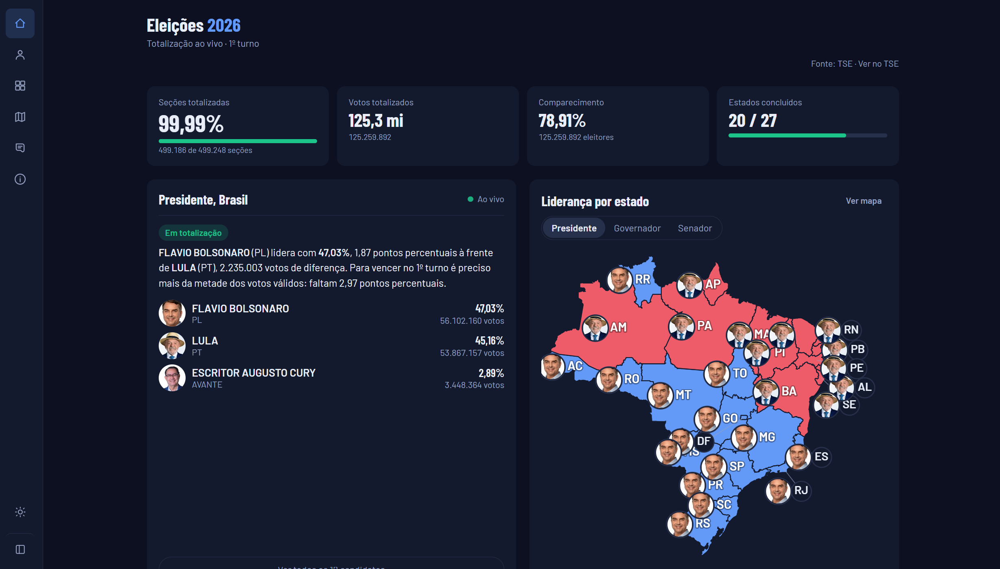
</p>

---

## O que ele faz

- **Todos os cargos de 2026**: Presidente (Brasil e por UF), Governador, Senador, Deputado federal, Deputado estadual e Deputado distrital.
- **Leitura em segundos**: quem lidera, por quantos pontos e votos, quanto falta para os 50% (Presidente e Governador), quem está dentro das vagas (Senado) e se a disputa já foi definida.
- **Fotos oficiais** das candidaturas, vindas do próprio TSE, e o número de cada candidato nas caixinhas da urna eletrônica.
- **Mapa colorido por candidato**: cada estado na cor de quem lidera, com a foto do líder ao lado da sigla; alternância entre Presidente, Governador e Senador (no Senado, mostra os dois mais votados).
- **Cards por região**: Norte, Nordeste, Centro-Oeste, Sudeste e Sul agrupam os estados, com o total já apurado da região e o candidato na frente de cada uma.
- **Apuração por estado**: quanto cada UF já apurou, lado a lado, com a bandeira do estado e a foto de quem lidera; ordene por andamento, nome ou região. Os votos do exterior aparecem à parte.
- **Visão de cada estado**: toque num estado e veja todos os cargos dele de uma vez, com os mais votados para Presidente, Governador, Senado e deputados.
- **Gráfico de evolução** com todos os candidatos, a cada 10 minutos ou a cada atualização do TSE, com o histórico guardado no servidor (quem chega às 22h vê a noite inteira).
- **Linha do tempo de novidades** ("O que está acontecendo agora"): marcos, viradas, estados concluídos e a conclusão com o resultado, com filtros e notificação própria.
- **Notícias por IA (opcional)**: com `DEEPSEEK_API_KEY`, a DeepSeek reescreve o texto das notícias de Presidente, sempre sobre os fatos já detectados.
- **Ao vivo**: a tela se atualiza sozinha assim que o TSE publica dados novos, sem recarregar.
- **Encerra sozinho**: quando todas as disputas fecham (100% + resultado definido), o servidor para de consultar o TSE e passa a servir do histórico; a tela avisa "Totalização encerrada".
- **Notificações no celular (PWA)**: siga uma disputa — ou o canal de novidades — e receba aviso no início, a cada 25%, em viradas, na conclusão e quando o resultado sair.
- **Busca** por nome, número ou partido nas listas de deputados (mais de mil candidatos em SP).
- **Tema escuro e claro**, com alternador manual, acessível e pensado primeiro para o celular.

> [!NOTE]
> Projeto independente, **sem vínculo com o TSE**. Os dados vêm dos arquivos públicos de resultados em `resultados.tse.jus.br`. Em caso de divergência, vale o resultado oficial do TSE.

## Telas

<details>
<summary>Ver as telas (desktop e celular)</summary>

| Início (desktop) | Início (celular) |
|---|---|
| <br>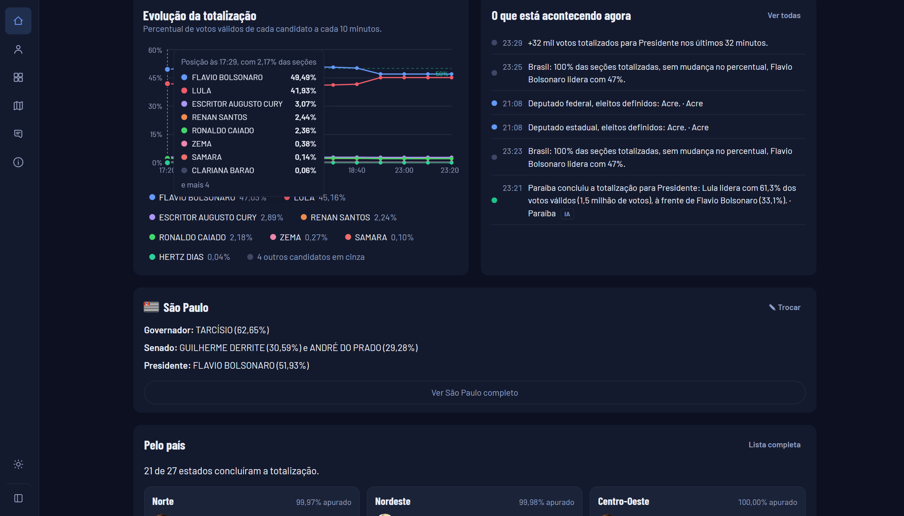<br>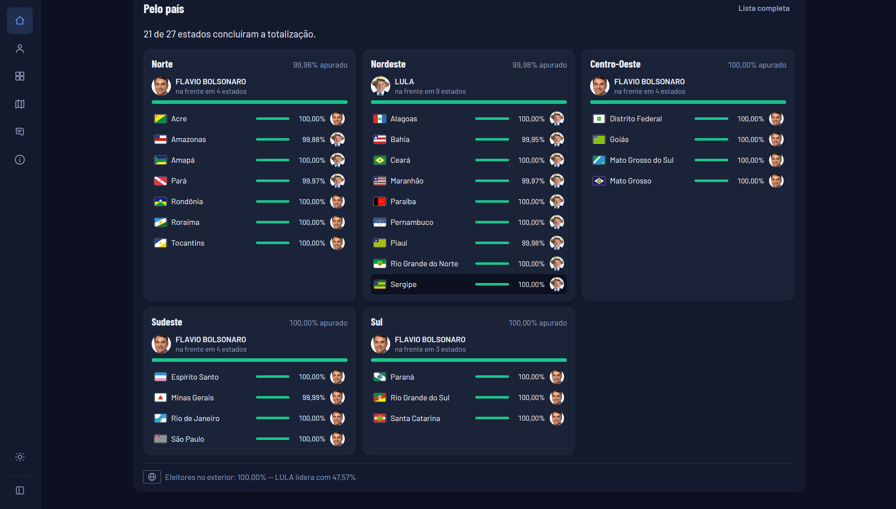 | 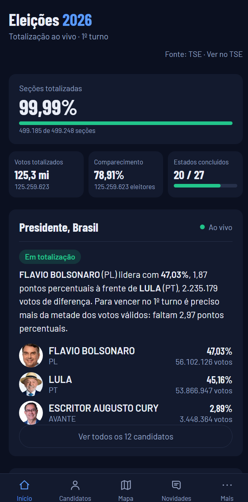 |

| Candidatos (desktop) | Candidatos (celular) |
|---|---|
| 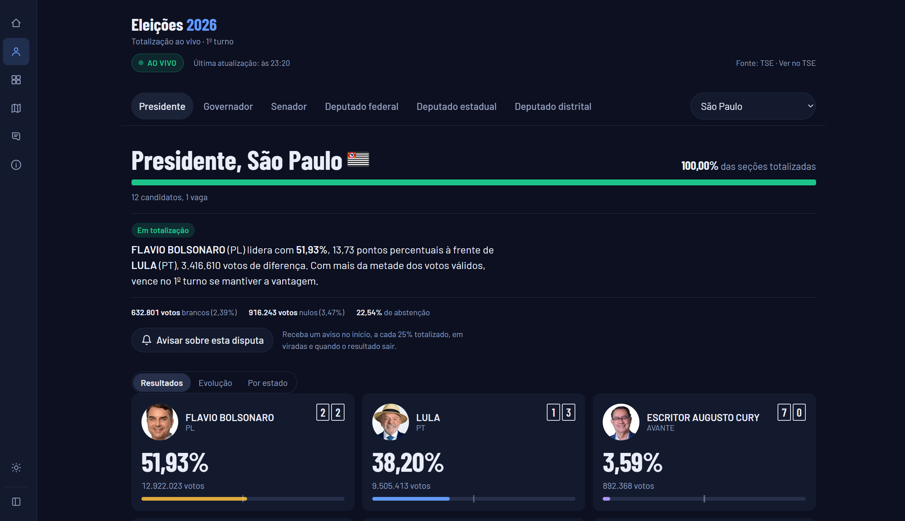 | 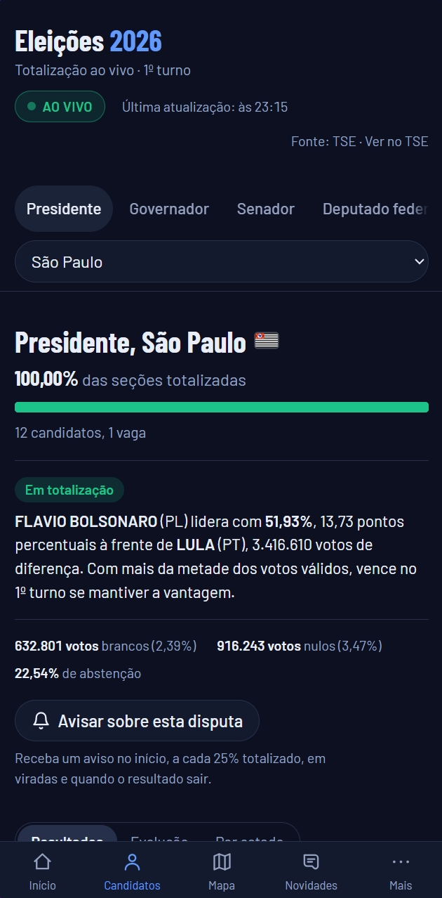 |

| Mapa (desktop) | Mapa (celular) |
|---|---|
| 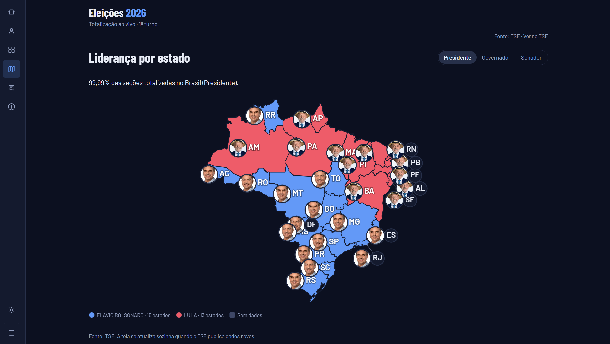 | 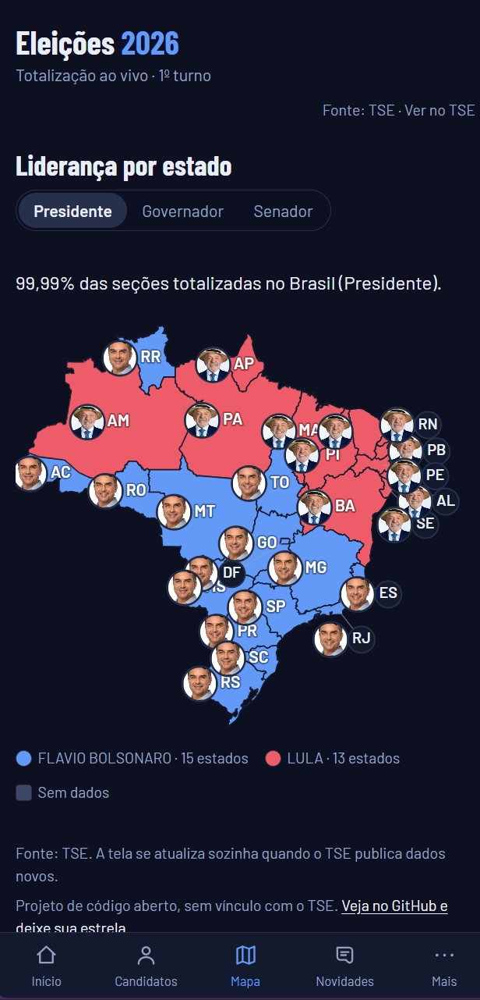 |

| Novidades (desktop) | Novidades (celular) |
|---|---|
| 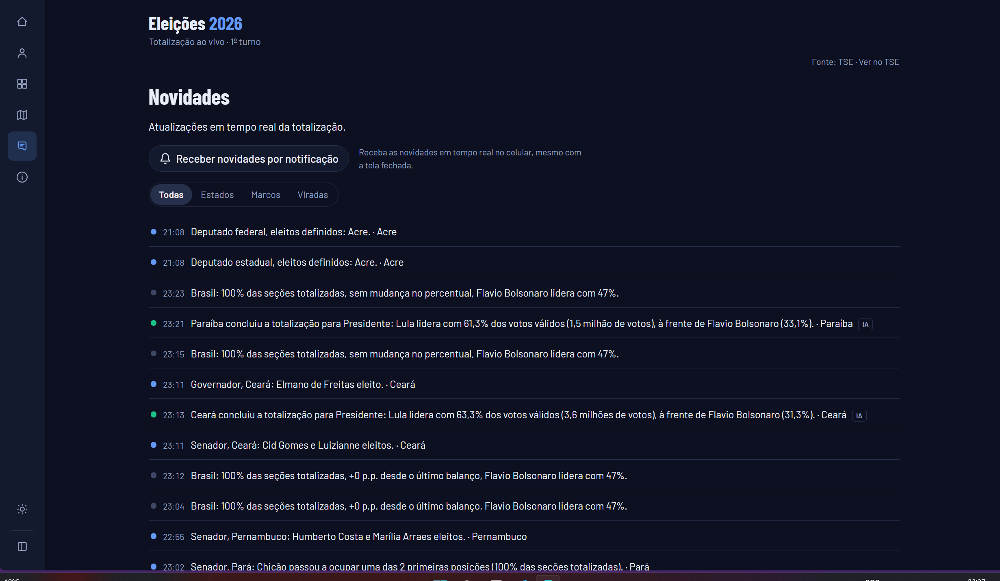 | 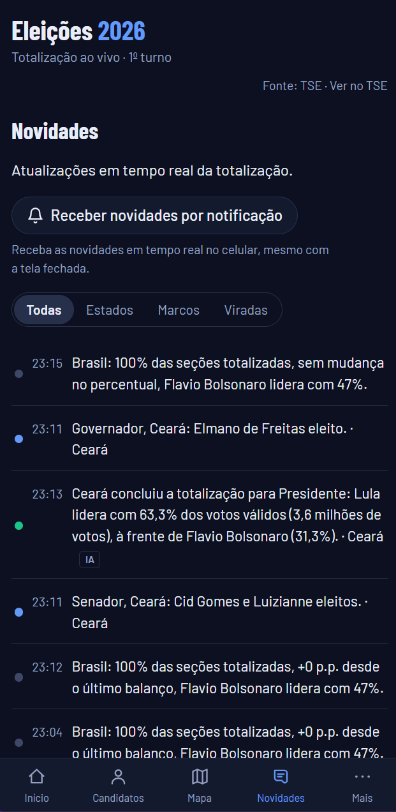 |

| Por estado (desktop) | Visão de um estado (desktop) |
|---|---|
| 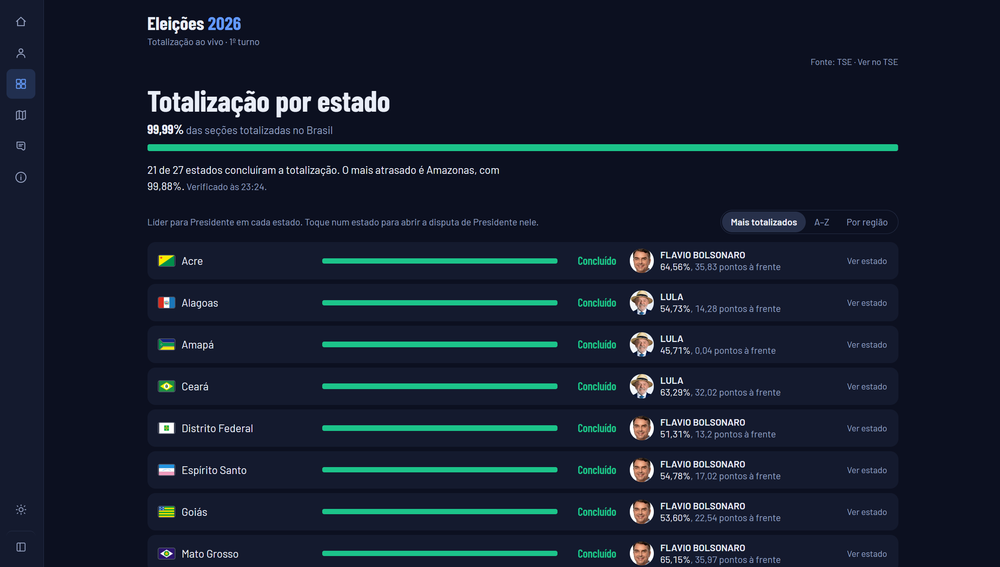 | 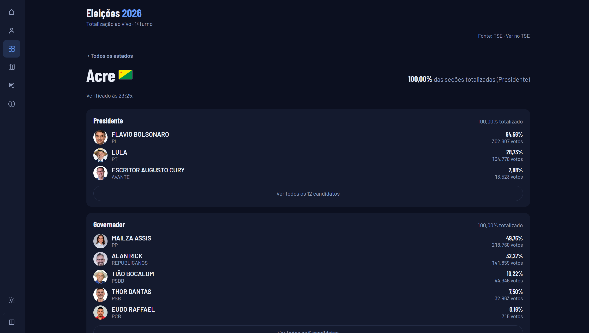 |

| Sobre (desktop) | Mais (celular) |
|---|---|
| 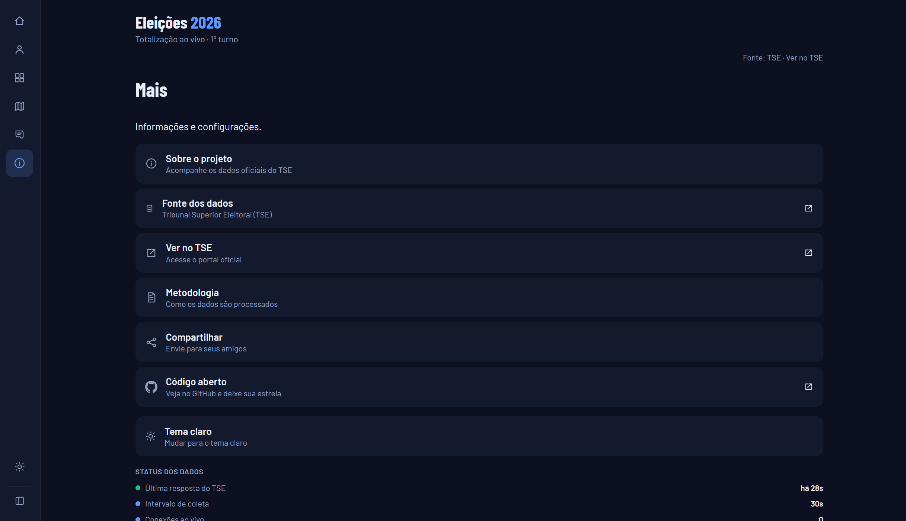 | 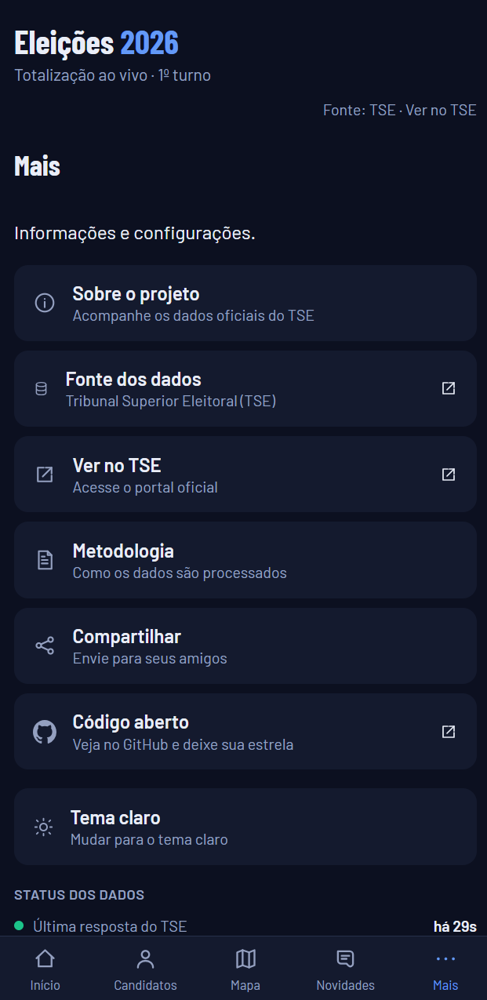 |

</details>

## Rodando em 1 minuto

Com Docker:

```bash
git clone https://github.com/code-cfernandes/eleicoes-2026-brasil.git
cd eleicoes-2026-brasil
docker compose up -d --build
```

Abra <http://localhost:3000>. Não precisa de `.env`: os padrões já apontam para o 1º turno de 2026.

Sem Docker (Node 24 ou superior):

```bash
npm install
cp .env.example .env
npm run build
npm start
```

## Como funciona

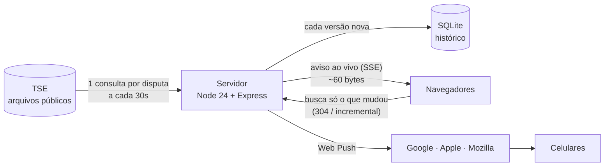

Algumas decisões que fazem diferença na noite da eleição:

| Problema | Solução |
|---|---|
| Milhares de pessoas abrindo o site não podem virar milhares de consultas ao TSE | Cache curto com deduplicação: **1 consulta por disputa a cada 30s**, não importa quantos aparelhos estejam abertos |
| Atualizar a tela sem cada aparelho perguntar "mudou?" a cada poucos segundos | **Server-Sent Events**: o servidor avisa quando o TSE publica uma versão nova; sem SSE disponível, a tela volta sozinha para consultas periódicas |
| Mil aparelhos buscando o mesmo resultado no mesmo segundo | O aviso só diz "tem versão nova"; cada aparelho espera um tempo aleatório proporcional à audiência antes de buscar, e o servidor serializa e comprime cada versão **uma única vez** |
| Baixar de novo o que o aparelho já tem | **ETag + 304** quando o TSE não mudou, e histórico **incremental** (`?desde=`) |
| Quem chega tarde não vê a evolução | Cada versão do TSE vai para o **SQLite**; o gráfico sai de uma consulta com janela de 10 minutos em Brasília |
| Notificação que vira spam | Avisos só nos momentos que importam, com estado persistido (ninguém recebe aviso repetido após restart) e expiração de 30 min |
| Continuar consultando o TSE depois que tudo fechou | Quando todas as disputas coletadas fecham (100% + resultado definido), o coletor **para** e o servidor passa a servir do histórico; um evento SSE `finalizado` avisa quem está com a tela aberta |

Números medidos num teste de carga local (Deputado federal SP, o JSON mais pesado):

| Aparelhos conectados ao vivo | Aviso chega a metade deles | Latência p99 da busca após o aviso |
|---|---|---|
| 1.000 | 8 ms | 25 ms |
| 5.000 | 20 ms | 10 ms |
| 10.000 | 86 ms | 18 ms |

## Configuração

Tudo por variáveis de ambiente (veja [`.env.example`](.env.example)). Com Docker, o `compose.yaml` já traz padrões para todas; no Portainer, basta cadastrar as que quiser mudar.

| Variável | Padrão | Para que serve |
|---|---|---|
| `ELEICAO_FEDERAL` / `ELEICAO_ESTADUAL` | descobertos no TSE | Códigos do 1º turno. Vazios, o servidor acha na lista de eleições do TSE pelo cargo (Presidente/Governador). Preencha só para forçar |
| `ELEICAO_FEDERAL_2T` / `ELEICAO_ESTADUAL_2T` | descobertos no TSE | Códigos do 2º turno, que vêm do campo `cdt2` do 1º turno. Conhecido o 2º turno, ele vira o atual (coletado ao vivo) e o padrão da tela; o 1º fica arquivado no seletor de turno. As disputas do 2º turno saem do resultado do 1º; antes de o TSE publicar os arquivos, a tela mostra os finalistas zerados |
| `INICIO_APURACAO` / `INICIO_APURACAO_2T` | 04/10 e 25/10, 17h | Início da totalização de cada turno (contagem regressiva no Início) |
| `CACHE_SEGUNDOS` | `30` | Intervalo de consulta ao TSE |
| `MONITORAR` | `br:1,*:1,*:3` | Disputas coletadas mesmo sem ninguém na tela. Formato `uf:cargo`, `*` vale todos (ex.: `br:1,*:1,*:3,*:5`). O que não existe no turno atual é descartado sozinho |
| `MAX_CONEXOES` | `5000` | Conexões ao vivo simultâneas; acima disso o aparelho volta às consultas periódicas |
| `MAX_INSCRICOES` | `50000` | Aparelhos inscritos em notificações |
| `VAPID_CONTATO` | — | Contato exigido pelos serviços de push: e-mail (o `mailto:` é completado sozinho) ou `https:`. Valor inválido não derruba o site, só gera aviso no log. Sem ele, a Apple pode recusar notificações |
| `VAPID_PUBLICA` / `VAPID_PRIVADA` | geradas sozinhas | Chaves das notificações. Se vazias, são criadas na 1ª execução e guardadas no volume |
| `DEEPSEEK_API_KEY` | — | Chave da DeepSeek. Sem ela, a linha do tempo usa só as frases-modelo do código |
| `DEEPSEEK_MODEL` | `deepseek-chat` | Modelo usado para reescrever as notícias |
| `DEEPSEEK_BASE_URL` | `https://api.deepseek.com` | Endereço da API da DeepSeek |
| `IA_INTERVALO_MIN` | `15` | Minutos entre duas chamadas à IA (custo e latência) |
| `NOTICIA_INTERVALO_MIN` | `5` | Minutos entre os balanços periódicos de Presidente/Brasil |
| `PORTA_HOST` | `3000` | Porta publicada pelo Docker |

Códigos dos cargos: `1` Presidente, `3` Governador, `5` Senador, `6` Dep. federal, `7` Dep. estadual, `8` Dep. distrital.

### Publicando

- **HTTPS é obrigatório** para instalar o app e receber notificações no celular (só `localhost` é exceção). Um proxy como Caddy, Traefik, nginx ou um **Cloudflare Tunnel nomeado** resolve, e ainda traz HTTP/2.
- O túnel rápido do Cloudflare (`*.trycloudflare.com`) não suporta SSE: serve para testes, e o site volta sozinho às consultas periódicas.
- No iPhone, as notificações só funcionam com o app **adicionado à Tela de Início** (iOS 16.4+). O site explica isso a quem abre pelo Safari.
- Não apague o volume `dados`: ele guarda o histórico e as chaves das notificações. Se as chaves mudarem, todos os aparelhos inscritos param de receber.

## Desenvolvimento

```bash
npm run dev:api     # backend com recarga automática (porta 3000)
npm run dev:web     # frontend Vite com proxy para a API
npm run typecheck   # tipos do backend e do frontend
```


```
server/    backend em TypeScript, executado direto pelo Node 24 (sem etapa de build)
  tse.ts            único ponto que conhece o formato do JSON do TSE
  historico.ts      SQLite: snapshots, consulta por faixa de 10 min e incremental
  eventos.ts        conexões ao vivo (SSE)
  novidades.ts      linha do tempo: marcos, viradas, conclusão e balanços periódicos
  notificacoes.ts   Web Push: inscrições, detecção de marcos e fila de envio
  ia.ts             redação de notícias pela DeepSeek (opcional, via DEEPSEEK_API_KEY)
web/       frontend React + Vite + Recharts, service worker e manifest do PWA
  componente/MapaBrasil.tsx   mapa do Brasil (andamento e líder por estado)
shared/    tipos usados pelo backend e pelo frontend
```

O TSE muda detalhes do leiaute entre eleições. Se algo quebrar num pleito futuro, o ajuste fica concentrado em `server/tse.ts`.

## Contribuindo

Issues e pull requests são bem-vindos: correções, melhorias de acessibilidade, suporte ao 2º turno ou a eleições municipais.

Se este projeto foi útil, **deixe uma ⭐ no repositório** e compartilhe com quem vai acompanhar a apuração.

## Créditos

- Resultados, fotos das candidaturas e configurações das eleições: arquivos públicos do [Tribunal Superior Eleitoral](https://resultados.tse.jus.br).
- Mapa do Brasil: malha territorial por UF do [IBGE](https://servicodados.ibge.gov.br/api/docs/malhas?versao=3) (dados abertos, © IBGE), simplificada para uso na web.
- Bandeiras dos estados: [Wikimedia Commons](https://commons.wikimedia.org), todas em domínio público (símbolos oficiais), convertidas para PNG em tamanho reduzido.

## Licença

[MIT](LICENSE): use, modifique e distribua à vontade, mantendo o aviso de copyright.
