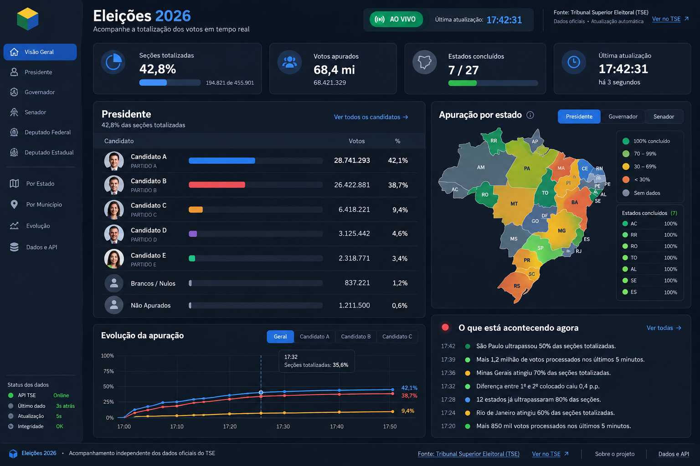
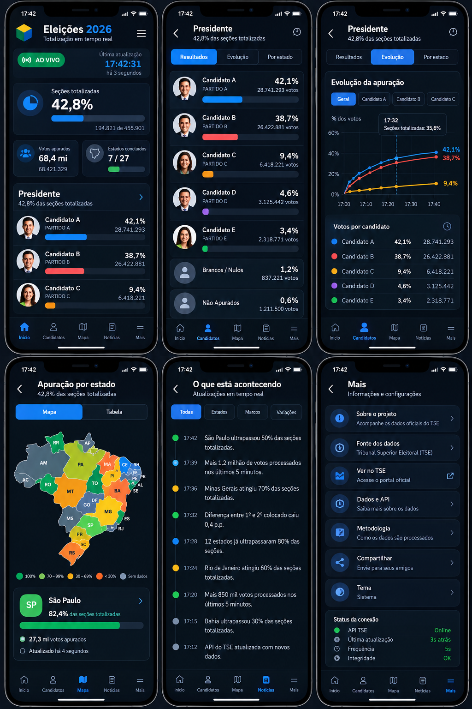

# Proposta de redesign: central de acompanhamento da totalização

Status: **em desenvolvimento** (não publicado). Objetivo: tornar o site uma central visual e rápida para acompanhar a totalização ao vivo, sem tentar copiar o portal do TSE.

| Desktop | Mobile |
|---|---|
|  |  |

> As imagens são referência de direção visual. Os números e nomes ("Candidato A") são fictícios.

## Princípios

1. **A sensação de "está acontecendo agora"**: indicador AO VIVO e horário da última atualização sempre visíveis.
2. **Ordem das perguntas**: quanto já foi contado → quem está na frente → como está evoluindo → onde já terminou → o que mudou.
3. **Dados, não opinião**: eventos são estatísticos ("SP passou de 50% das seções"), nunca análise política.
4. **Confiança**: fonte TSE visível no topo e no rodapé, com link para conferir no portal oficial.
5. **Termo correto**: o TSE diferencia *apuração* (em cada urna, gera o Boletim de Urna) de *totalização* (soma dos boletins). O site mostra a **totalização**: usar "Totalização ao vivo" e "seções totalizadas".

## O que adotamos da proposta, e o que ajustamos

| Elemento | Decisão |
|---|---|
| Visual escuro de "produto de dados", cards em azul/cinza, destaque só para AO VIVO | **Adotar.** O escuro passa a ser o tema de referência; o claro continua funcionando (preferência do sistema). |
| Indicadores no topo: seções totalizadas, votos apurados, estados concluídos, última atualização | **Adotar**, mas mostrar "última atualização" **uma vez só** (na proposta aparece duplicado no cabeçalho e no card). |
| Tabela de Presidente com barras | **Adotar.** Manter foto oficial, partido e o resumo em texto (vantagem em pontos percentuais, falta para mais da metade dos votos válidos). |
| Linhas "Brancos/Nulos" e "Não apurados" dentro da tabela de candidatos | **Ajustar.** Percentuais de candidatos são sobre votos **válidos**; brancos e nulos não entram nessa conta. Mostrar brancos, nulos e abstenção num bloco à parte, com o percentual sobre o total de votos. "Não apurados" não é uma fração de votos e sai. |
| Evolução da apuração (% dos votos × hora) | **Adotar** (já existe; vira bloco de destaque com abas por candidato). |
| Mapa do Brasil por % totalizado | **Adotar**, com escala **sequencial de uma só cor** (claro → escuro conforme avança). A proposta usa verde/amarelo/laranja/vermelho, que parece "bom/ruim" e conflita com as cores dos candidatos. Alternância Presidente / Governador / Senador para mostrar o líder por estado. Sempre com a lista/tabela como alternativa acessível. |
| "O que está acontecendo agora" | **Adotar.** O servidor já detecta marcos, viradas e resultados definidos para as notificações; passa a gravá-los e publicá-los como linha do tempo, somando "estado concluído", ritmo de votos e mudança de diferença. |
| Status dos dados (API TSE, último dado, frequência, integridade) | **Ajustar.** Mostrar só o que é medido de fato: última resposta do TSE, falhas recentes, intervalo de coleta, conexão ao vivo. Não exibir "Integridade OK" sem uma verificação real por trás. |
| Mobile com navegação inferior de 5 itens: Início, Candidatos, Mapa, Novidades, Mais | **Adotar.** "Candidatos" abre o cargo escolhido com abas **Resultados / Evolução / Por estado**. Os demais cargos são escolhidos dentro dessa tela. |
| "Por município", "Dados e API" | **Fora do escopo agora** (município exige milhares de arquivos do TSE). "Dados e API" pode entrar em "Mais" como documentação da nossa API. |
| Medalhas 🥇🥈🥉 | **Não usar.** A posição já está na ordem e no resumo. |
| Identidade atual (caixinhas de número da urna, bandeiras, fotos oficiais) | **Manter** onde ajuda a reconhecer: caixinhas no detalhe do candidato, bandeiras no mapa e nas listas. |

Também continuam: **Seu estado** (escolha salva no aparelho), **Pelo país** e a **visão do estado**, que já estão no ar e foram aprovados.

## Arquitetura de informação

**Desktop (sidebar recolhível à esquerda):** Visão geral · Presidente · Governador · Senador · Deputado federal · Deputado estadual/distrital · Por estado · Mapa · Sobre. Rodapé da sidebar: status dos dados.

**Visão geral (desktop):** cabeçalho com AO VIVO + última atualização + fonte TSE → 4 indicadores → Presidente (tabela) | Mapa por estado → Evolução | O que está acontecendo agora → Seu estado.

**Mobile (navegação inferior):**

| Aba | Conteúdo |
|---|---|
| Início | AO VIVO + última atualização, % totalizado, votos apurados e estados concluídos, top 3 de Presidente, Seu estado |
| Candidatos | Seletor de cargo e local; abas Resultados / Evolução / Por estado |
| Mapa | Mapa com alternância de cargo e lista; tocar num estado abre a visão do estado |
| Novidades | "O que está acontecendo agora", filtros: Todas / Estados / Marcos / Viradas |
| Mais | Sobre o projeto, fonte TSE e link oficial, metodologia, status dos dados, compartilhar, código no GitHub |

## Dados (contrato em `shared/tipos.ts`)

| Necessidade | Fonte |
|---|---|
| Votos apurados, válidos, brancos, nulos, comparecimento, abstenção, seções | `Resultado.totais` (mesmo arquivo do TSE, sem consulta extra) |
| Mapa e lista por estado, líder por cargo | `GET /api/panorama?cargo=1|3|5` |
| Linha do tempo | `GET /api/novidades?desde=<id>` |
| Status dos dados | `GET /api/saude` → `dados` |
| Ao vivo | SSE `GET /api/eventos?uf=&cargo=` (já existe) |

Custos continuam proporcionais ao número de disputas, não de aparelhos: tudo passa pelo cache, com ETag/304.

## Execução em paralelo

| Frente | Responsável | Arquivos |
|---|---|---|
| Backend: totais, panorama por cargo, novidades, saúde | agente de backend | `server/`, `shared/tipos.ts` (só acrescentar) |
| Mapa do Brasil (geometria IBGE, componente, escala sequencial, acessibilidade) | agente do mapa | `web/src/componentes/MapaBrasil.tsx`, `web/public/mapa/` |
| Tema escuro, layout desktop/mobile, telas | agente de design | demais arquivos de `web/` |
| Coordenação, revisão, documentação | coordenador | `docs/`, `README.md` |

Nada é publicado sem revisão. O 2º turno (separação dos dados por turno, tela cara a cara, seletor de turno) é a etapa seguinte, antes de 25/10.
